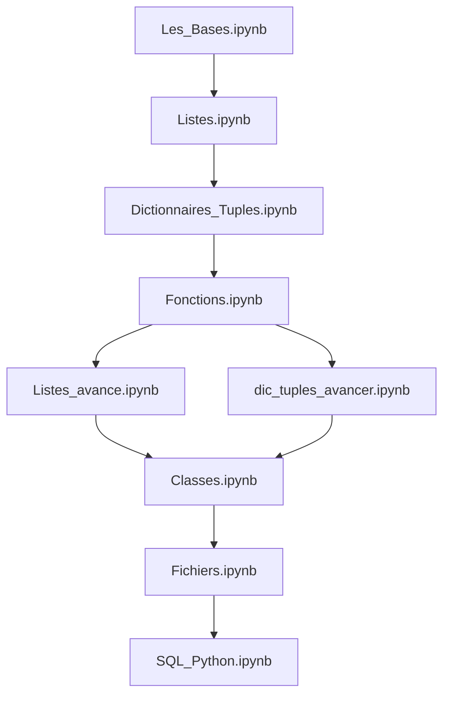

<!-- Improved compatibility of back to top link: See: https://github.com/othneildrew/Best-README-Template/pull/73 -->

<a id="readme-top"></a>

<!--
*** Thanks for checking out this Python Challenges repository!
*** If you find it helpful, please give it a star!
*** Happy Learning! :D
-->

<!-- PROJECT SHIELDS -->
<!--
*** I'm using markdown "reference style" links for readability.
*** Reference links are enclosed in brackets [ ] instead of parentheses ( ).
*** See the bottom of this document for the declaration of the reference variables
*** for contributors-url, forks-url, etc. This is an optional, concise syntax you may use.
*** https://www.markdownguide.org/basic-syntax/#reference-style-links
-->

[![Contributors][contributors-shield]][contributors-url]
[![Forks][forks-shield]][forks-url]
[![Stargazers][stars-shield]][stars-url]
[![Issues][issues-shield]][issues-url]
[![MIT License][license-shield]][license-url]
[![LinkedIn][linkedin-shield]][linkedin-url]

<!-- PROJECT LOGO -->
<br />
<div align="center">
  <a href="https://github.com/issam-mhj/Python_challenges">
    
  </a>

<h3 align="center">Python Challenges & Learning Resources</h3>

  <p align="center">
    A comprehensive collection of Python exercises and tutorials covering fundamentals to advanced topics
    <br />
    <a href="https://github.com/issam-mhj/Python_challenges"><strong>Explore the docs »</strong></a>
    <br />
    <br />
    <a href="https://github.com/issam-mhj/Python_challenges">View Demo</a>
    ·
    <a href="https://github.com/issam-mhj/Python_challenges/issues/new?labels=bug&template=bug-report---.md">Report Bug</a>
    ·
    <a href="https://github.com/issam-mhj/Python_challenges/issues/new?labels=enhancement&template=feature-request---.md">Request Feature</a>
  </p>
</div>

<!-- TABLE OF CONTENTS -->
<details>
  <summary>Table of Contents</summary>
  <ol>
    <li>
      <a href="#about-the-project">About The Project</a>
      <ul>
        <li><a href="#built-with">Built With</a></li>
      </ul>
    </li>
    <li>
      <a href="#getting-started">Getting Started</a>
      <ul>
        <li><a href="#prerequisites">Prerequisites</a></li>
        <li><a href="#installation">Installation</a></li>
      </ul>
    </li>
    <li><a href="#notebooks-overview">Notebooks Overview</a></li>
    <li><a href="#usage">Usage</a></li>
    <li><a href="#learning-path">Learning Path</a></li>
    <li><a href="#contributing">Contributing</a></li>
    <li><a href="#license">License</a></li>
    <li><a href="#contact">Contact</a></li>
    <li><a href="#acknowledgments">Acknowledgments</a></li>
  </ol>
</details>

<!-- ABOUT THE PROJECT -->

## About The Project

This repository contains a curated collection of Python challenges, exercises, and tutorials designed to help learners progress from basic programming concepts to advanced Python features. Each notebook focuses on specific topics with practical examples, exercises, and real-world applications.

Whether you're a beginner starting your Python journey or an intermediate developer looking to solidify your knowledge, these notebooks provide hands-on practice with:

* **Core Python Fundamentals** - Variables, data types, operators, and control flow
* **Data Structures** - Lists, dictionaries, tuples, and sets
* **Functions** - Function definition, parameters, lambda functions, and decorators
* **Object-Oriented Programming** - Classes, inheritance, polymorphism, and encapsulation
* **File Handling** - Reading, writing, and manipulating files
* **Database Integration** - Working with SQL and Python

<p align="right">(<a href="#readme-top">back to top</a>)</p>

### Built With

* [![Python][Python.py]][Python-url]
* [![Jupyter][Jupyter.org]][Jupyter-url]
* [![SQLite][SQLite.org]][SQLite-url]

<p align="right">(<a href="#readme-top">back to top</a>)</p>

<!-- GETTING STARTED -->

## Getting Started

To get started with these Python challenges, follow these simple steps.

### Prerequisites

* **Python:** Version 3.7 or higher
  ```sh
  python --version
  ```

* **pip:** Python package installer (usually comes with Python)
  ```sh
  pip --version
  ```

* **Jupyter Notebook or JupyterLab** (recommended for interactive learning)
  ```sh
  pip install jupyter
  ```

### Installation

1. Clone the repository:
   ```sh
   git clone https://github.com/issam-mhj/Python_challenges.git
   cd Python_challenges
   ```

2. Create a virtual environment (recommended):
   ```sh
   python -m venv .venv
   ```

3. Activate the virtual environment:
   * **Windows (PowerShell):**
     ```sh
     .\.venv\Scripts\Activate.ps1
     ```
   * **Windows (Command Prompt):**
     ```sh
     .venv\Scripts\activate.bat
     ```
   * **macOS/Linux:**
     ```sh
     source .venv/bin/activate
     ```

4. Install required dependencies:
   ```sh
   pip install jupyter notebook pandas numpy
   ```

5. Launch Jupyter Notebook:
   ```sh
   jupyter notebook
   ```

<p align="right">(<a href="#readme-top">back to top</a>)</p>

<!-- NOTEBOOKS OVERVIEW -->

## Notebooks Overview

### 📘 Fundamentals

#### `Les_Bases.ipynb` - Python Basics
Introduction to Python programming covering:
- Variables and data types
- Basic operators (arithmetic, comparison, logical)
- Input/output operations
- Control structures (if/else, loops)
- Basic string manipulation

---

### 📗 Data Structures

#### `Listes.ipynb` - Lists Fundamentals
Core concepts of Python lists:
- List creation and initialization
- Accessing and modifying elements
- List methods (append, insert, remove, pop)
- List slicing and indexing
- Basic list operations

#### `Listes_avance.ipynb` - Advanced Lists
Advanced list manipulation:
- List comprehensions
- Nested lists and multi-dimensional arrays
- Sorting and filtering
- Map, filter, and reduce functions
- Performance optimization techniques

#### `Dictionnaires_Tuples.ipynb` - Dictionaries & Tuples
Working with key-value pairs and immutable sequences:
- Dictionary creation and manipulation
- Dictionary methods and operations
- Tuple basics and use cases
- When to use dictionaries vs. tuples
- Nested data structures

#### `dic_tuples_avancer.ipynb` - Advanced Dictionaries & Tuples
Advanced techniques:
- Dictionary comprehensions
- Advanced tuple operations
- Combining data structures
- Real-world data processing examples

---

### 📙 Functions & OOP

#### `Fonctions.ipynb` - Functions
Mastering Python functions:
- Function definition and calling
- Parameters and arguments (positional, keyword, default)
- Return values
- Lambda functions
- Scope and namespaces
- Decorators and closures

#### `Classes.ipynb` - Object-Oriented Programming
Introduction to OOP in Python:
- Class definition and instantiation
- Attributes and methods
- Constructors (`__init__`)
- Inheritance and polymorphism
- Encapsulation and data hiding
- Magic methods and operator overloading

---

### 📕 File Handling & Databases

#### `Fichiers.ipynb` - File Operations
Working with files in Python:
- Opening and closing files
- Reading and writing text files
- File modes (read, write, append)
- Working with CSV and JSON files
- Exception handling with files
- Context managers (`with` statement)

#### `SQL_Python.ipynb` - SQL Integration
Connecting Python with databases:
- SQLite integration
- Creating and managing databases
- CRUD operations (Create, Read, Update, Delete)
- SQL queries in Python
- Using pandas with SQL
- Database transactions and error handling

#### `sql.py` - SQL Helper Module
Python module containing:
- Database connection utilities
- Helper functions for SQL operations
- Reusable code for database interactions

<p align="right">(<a href="#readme-top">back to top</a>)</p>

<!-- USAGE EXAMPLES -->

## Usage

### Opening a Notebook

1. Start Jupyter Notebook from the project directory:
   ```sh
   jupyter notebook
   ```

2. Your web browser will open with the Jupyter interface

3. Click on any `.ipynb` file to open it

4. Run cells using `Shift + Enter` or the "Run" button

### Running Python Scripts

For standalone Python files like `sql.py`:

```sh
python sql.py
```

### Interactive Learning

Each notebook contains:
- **📖 Theory:** Explanations of concepts
- **💻 Examples:** Code demonstrations
- **✏️ Exercises:** Practice problems
- **🎯 Solutions:** Reference implementations

Work through notebooks sequentially or jump to specific topics based on your needs.

<p align="right">(<a href="#readme-top">back to top</a>)</p>

<!-- LEARNING PATH -->

## Learning Path

For beginners, we recommend following this order:



**Recommended Study Plan:**

1. **Week 1-2:** Python Basics + Lists
2. **Week 3:** Dictionaries & Tuples
3. **Week 4:** Functions
4. **Week 5:** Advanced Data Structures
5. **Week 6:** Object-Oriented Programming
6. **Week 7:** File Handling
7. **Week 8:** Database Integration

<p align="right">(<a href="#readme-top">back to top</a>)</p>

<!-- CONTRIBUTING -->

## Contributing

Contributions are what make the open source community such an amazing place to learn, inspire, and create. Any contributions you make are **greatly appreciated**.

If you have a suggestion that would make this better, please fork the repo and create a pull request. You can also simply open an issue with the tag "enhancement".

Don't forget to give the project a star! Thanks again!

1. Fork the Project
2. Create your Feature Branch (`git checkout -b feature/AmazingFeature`)
3. Commit your Changes (`git commit -m 'Add some AmazingFeature'`)
4. Push to the Branch (`git push origin feature/AmazingFeature`)
5. Open a Pull Request

### Ways to Contribute

- 🐛 Report bugs and issues
- 💡 Suggest new challenges or topics
- ✍️ Improve documentation
- 🎨 Add new exercises or examples
- 🌍 Translate content to other languages

<p align="right">(<a href="#readme-top">back to top</a>)</p>

### Top contributors:

<a href="https://github.com/issam-mhj/Python_challenges/graphs/contributors">
  
</a>

<!-- LICENSE -->

## License

Distributed under the MIT License. See `LICENSE.txt` for more information.

<p align="right">(<a href="#readme-top">back to top</a>)</p>

<!-- CONTACT -->

## Contact

Issam MHJ - [@issam-mhj](https://github.com/issam-mhj) - issam.mhj@example.com

Project Link: [https://github.com/issam-mhj/Python_challenges](https://github.com/issam-mhj/Python_challenges)

<p align="right">(<a href="#readme-top">back to top</a>)</p>

<!-- ACKNOWLEDGMENTS -->

## Acknowledgments

* [Python Official Documentation](https://docs.python.org/3/)
* [Jupyter Notebook Documentation](https://jupyter-notebook.readthedocs.io/)
* [Real Python Tutorials](https://realpython.com/)
* [Python for Beginners](https://www.python.org/about/gettingstarted/)
* [Best README Template](https://github.com/othneildrew/Best-README-Template)
* [Choose an Open Source License](https://choosealicense.com)
* [Img Shields](https://shields.io)

<p align="right">(<a href="#readme-top">back to top</a>)</p>

<!-- MARKDOWN LINKS & IMAGES -->
<!-- https://www.markdownguide.org/basic-syntax/#reference-style-links -->

[contributors-shield]: https://img.shields.io/github/contributors/issam-mhj/Python_challenges.svg?style=for-the-badge
[contributors-url]: https://github.com/issam-mhj/Python_challenges/graphs/contributors
[forks-shield]: https://img.shields.io/github/forks/issam-mhj/Python_challenges.svg?style=for-the-badge
[forks-url]: https://github.com/issam-mhj/Python_challenges/network/members
[stars-shield]: https://img.shields.io/github/stars/issam-mhj/Python_challenges.svg?style=for-the-badge
[stars-url]: https://github.com/issam-mhj/Python_challenges/stargazers
[issues-shield]: https://img.shields.io/github/issues/issam-mhj/Python_challenges.svg?style=for-the-badge
[issues-url]: https://github.com/issam-mhj/Python_challenges/issues
[license-shield]: https://img.shields.io/github/license/issam-mhj/Python_challenges.svg?style=for-the-badge
[license-url]: https://github.com/issam-mhj/Python_challenges/blob/main/LICENSE.txt
[linkedin-shield]: https://img.shields.io/badge/-LinkedIn-black.svg?style=for-the-badge&logo=linkedin&colorB=555
[linkedin-url]: https://linkedin.com/in/linkedin_username
[Python.py]: https://img.shields.io/badge/Python-3776AB?style=for-the-badge&logo=python&logoColor=white
[Python-url]: https://www.python.org/
[Jupyter.org]: https://img.shields.io/badge/Jupyter-F37626?style=for-the-badge&logo=jupyter&logoColor=white
[Jupyter-url]: https://jupyter.org/
[SQLite.org]: https://img.shields.io/badge/SQLite-003B57?style=for-the-badge&logo=sqlite&logoColor=white
[SQLite-url]: https://www.sqlite.org/